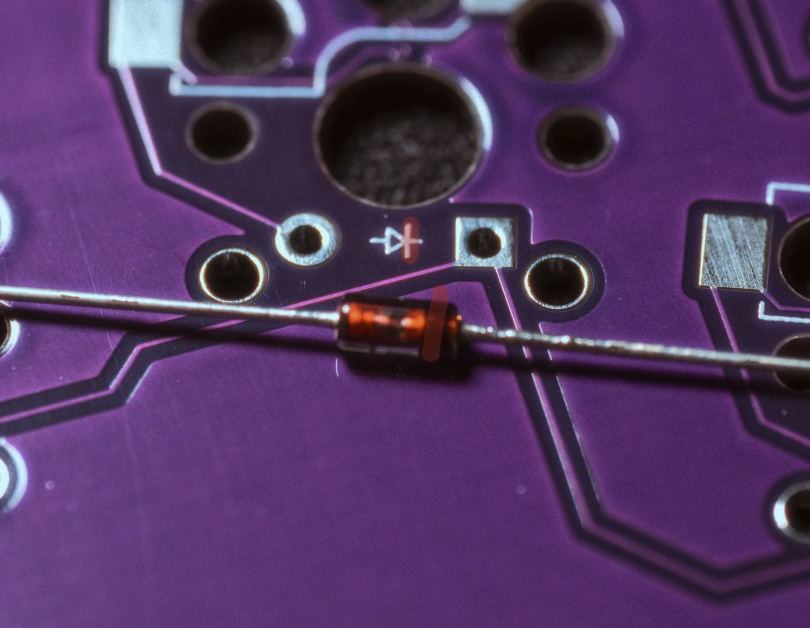
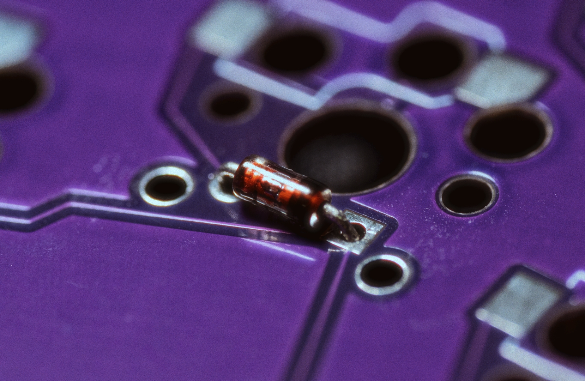
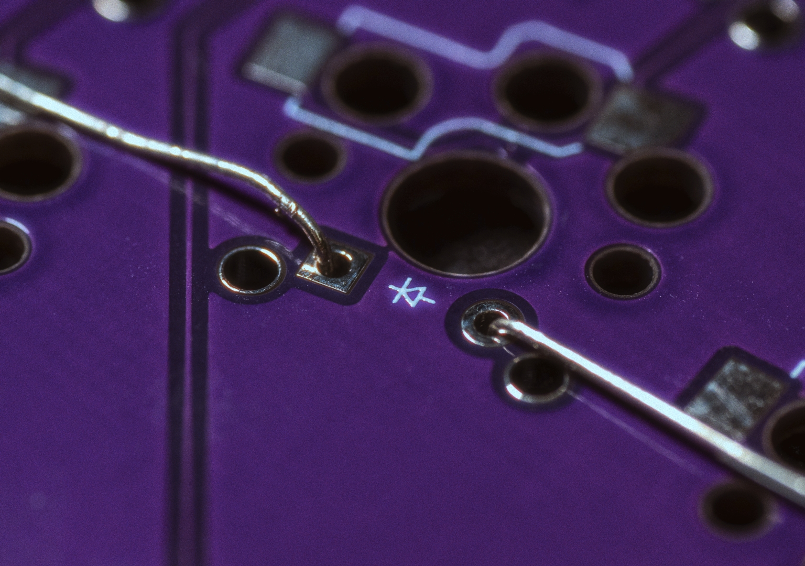
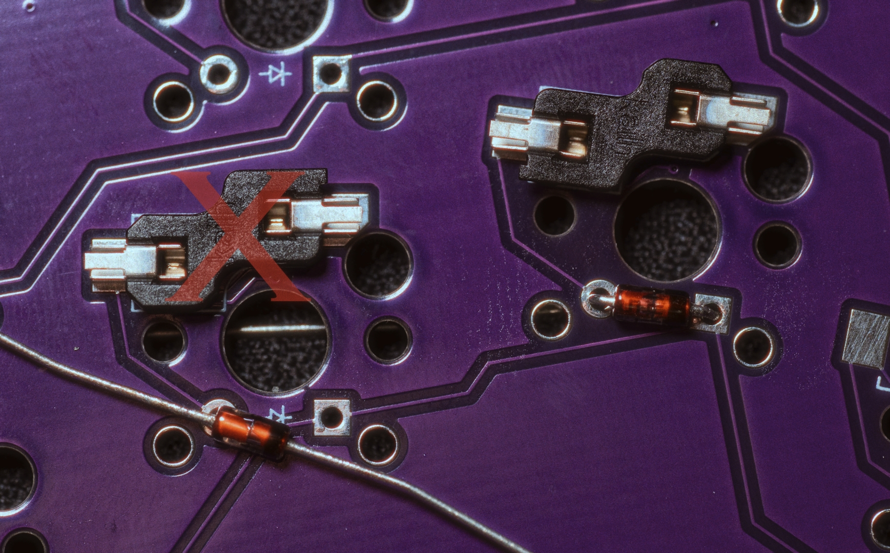
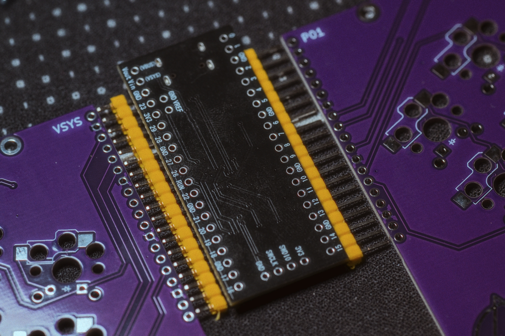
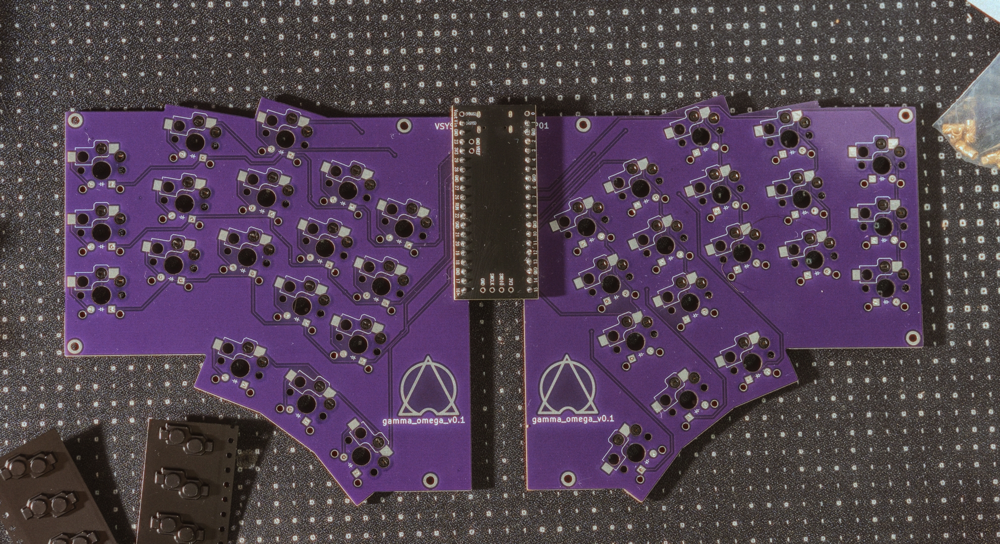
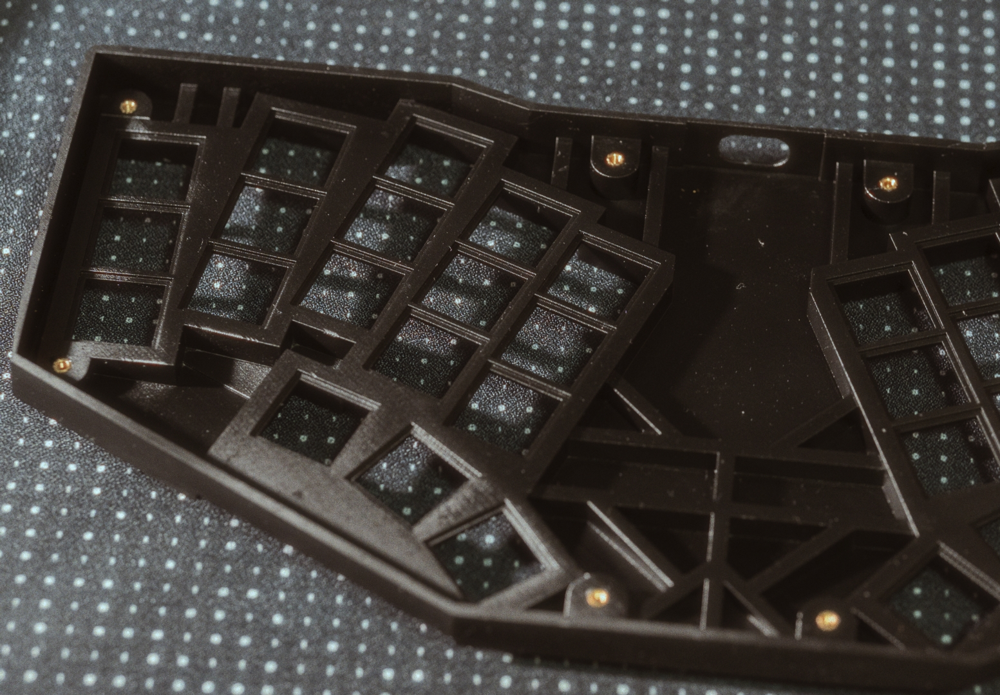

# Parts List
| Part | Quantity | Details | Source |
|------------------|----------|-----------------|--------|
| M2x2 Insert | 4 | 2mm length, 3.0mm diameter | |
| M2x6 Insert | 4 | 6mm length, 3.0mm diameter | |
| M2 Countersunk screw | 4 | 6mm length | |
| M2 Countersunk screw | 4 | 8mm length (or 6mm × 8) | |
| Feet bumpons | 6 | 8mm diameter | |
| 1n4148 diode | 36 | Standard size | [Aliexpress](https://a.aliexpress.com/_oCcCwmR) |
| Kailh Choc PG1350 Hot Swap Sockets | 36 | | |
| Kailh Choc switches | 36 | PG1350 (v1) or PG1353 (v2) or LOFREE low profile POM | |
| Gamma Omega PCB | 2 | 1.6mm thickness | JLCPCB |
| Top case | 1 | SLA Resin | JLC3DP |
| Bottom case | 1 | SLA Resin | JLC3DP |
| Pi Pico USB-C RP2040 | 1 | Standard microcontroller size | [Aliexpress](https://a.aliexpress.com/_opuRQZl) |

## Tools

- Soldering tools.
- Safety gears.
- epoxy adhesive
    - or cyanoacrylate adhesive would be fine too) for fixing inserts.

# Build Guide

## Diodes Installation

*Install diodes with their direction matching the PCB silkscreen markings*

1. Install diodes carefully, paying close attention to the correct orientation.
2. The direction of the diode must match the silkscreen markings on the PCB.
3. Ensure all diodes are installed parallel on the tht.

## Hotswap Socket Installation

1. Install hotswap sockets according to the PCB markings.
2. Ensure correct orientation of the sockets; while they can physically fit in either direction, the bottom case cutouts are designed for the correct orientation only.

## Pi Pico Installation

1. Install the Pi Pico on the UP side of the PCB (opposite from where sockets and diodes are installed).
2. Position the Pi Pico with its components facing down toward the PCB and the USB port facing outward.
3. **Dont forget:** Do not solder the top left and right pins (the ones closest to the USB port).
4. After soldering, carefully trim all protruding pins with a nipper. Caution: trimmed pins may be sharp.

*Your PCB should look like this when completed*

## Firmware Flashing
1. Press and hold the `BOOT` button while connecting the keyboard to your computer.
2. Release the `BOOT` button when a Mass Storage device named "RPI-RP2" appears.
3. Copy the `gamma_omega_vial.uf2` firmware file to this storage device.
4. The storage will disconnect automatically, and the device will function as a keyboard when the firmware is successfully installed.

## Testing
Use your favorite keystroke tester (or Vial's Key matrix tester) with a conductive tweezer to verify that all keys are working properly.

## Case Assembly

1. Install 6mm threaded inserts with epoxy adhesive on the top case (upper side, near the USB port hole).
2. Install 2mm threaded inserts with epoxy adhesive on the top case (lower side, opposite the USB port hole).

3. Place the PCB onto the top case.
4. Install switches into the top case while holding the PCB (hotswap sockets) in place.
5. Place the bottom case onto the top case assembly.
6. Secure with screws (8mm or 6mm for upper side, 6mm for lower side). Do not overtighten: the screws only need to support the bottom case's weight.