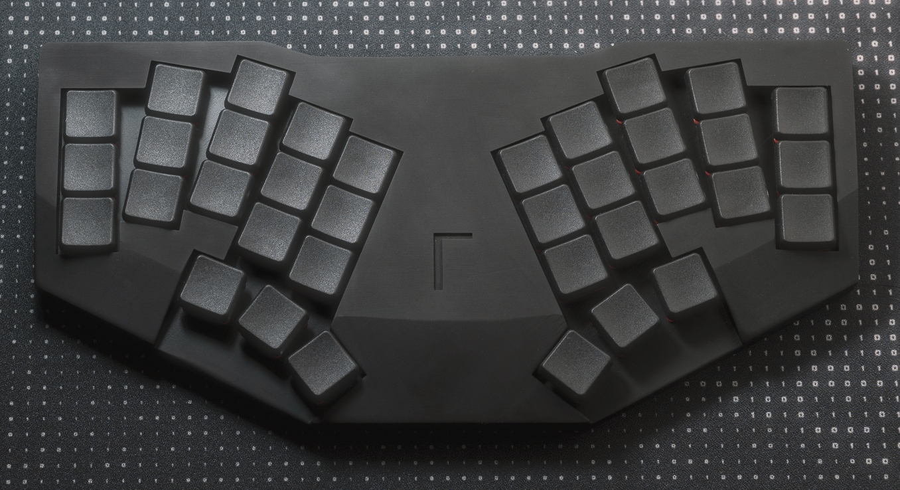
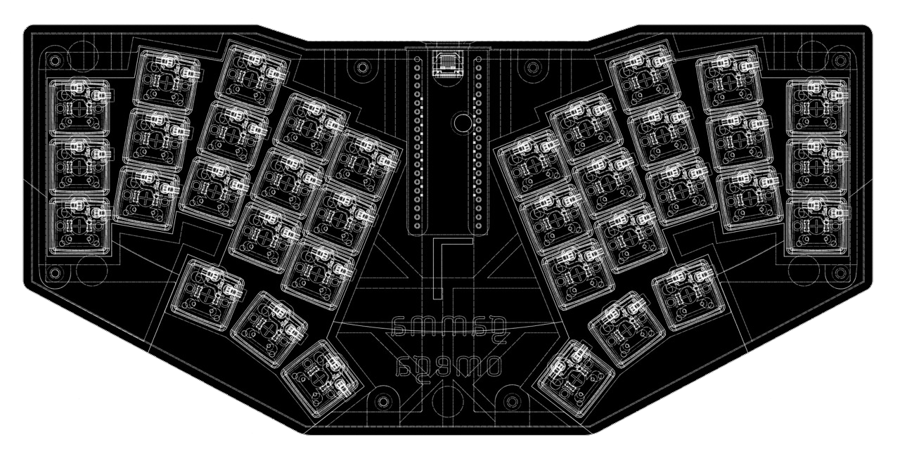

# GAMMA OMEGA

A 36 Keys low-profile unibody ergonomic keyboard designed for portability and durability while still maintaining comfort.

*Portable? It may not be very compact, but you can still just toss it in your bag, right?*

## Quick Links

- [3D Printable Case](cases/)
- [PCB Files](pcb/)
  - [Gerber](pcb/gerber/)
- Ergogen Configuration - *TODO*
- Firmwares:
  - [QMK/VIAL Implementation](firmwares/QMK/gamma_omega/)
    - [Precompiled](firmwares/precompiled/)
- [Build Guide](BUILD_GUIDE.md)

## Technical Details

### ergogen
The PCB was generated using [Ergogen](https://github.com/ergogen/ergogen), an ergonomic keyboard generator tool that simplifies the creation of custom keyboard layouts.

### Spacing

18 x 17mm (Choc spacing with in a tighter grid)

### Dimensions

 - Length: 246mm
 -  Width: 119mm
 - Height: approx. 18mm 
   - feet to keycap (2mm height rubber feet and CFX choc v1 keycap)

### Weight

full built: approx. 301g

## Changelog

### Case
- **v0.0.2**
  - Correct the inner curve's unwanted thickness on the top case.
- **v0.0.1** (Initial Release)
  - First public version of the 3D printable case

### PCB
- **v0.0.2**
  - add gerber for the production.
- **v0.0.1** (Initial Release)
  - First public version of the PCB design

### Firmware
 - **v0.0.1**
   - add default vanilla keymaps.
   - add pre-compiled firmware files.

## Development Roadmap

- [x] Fix case model warnings (minor issues)
- [ ] Correct PCB 3D model representation
- [x] Implement firmware support
- [x] Add default keymap
- [ ] Clean up Ergogen configuration
- [ ] Write PCB Schematic...? maybe
- [ ] Support FDM/MJF version case w/ heat set insert method.

## Speical thanks

[@GEIGEIGEIST](https://github.com/GEIGEIGEIST)
- This project was greatly inspired by his work. In particular, TOTEM. [TOTEM](https://github.com/GEIGEIGEIST/totem) is my favorite lo-pro split keyboard. Please check it out.​​​​​​​​​​​​​​​​

## Contributing

Contributions are welcome! Feel free to submit pull requests or open issues for any improvements or bug fixes.

But I don't know much about modeling and PCB design.
