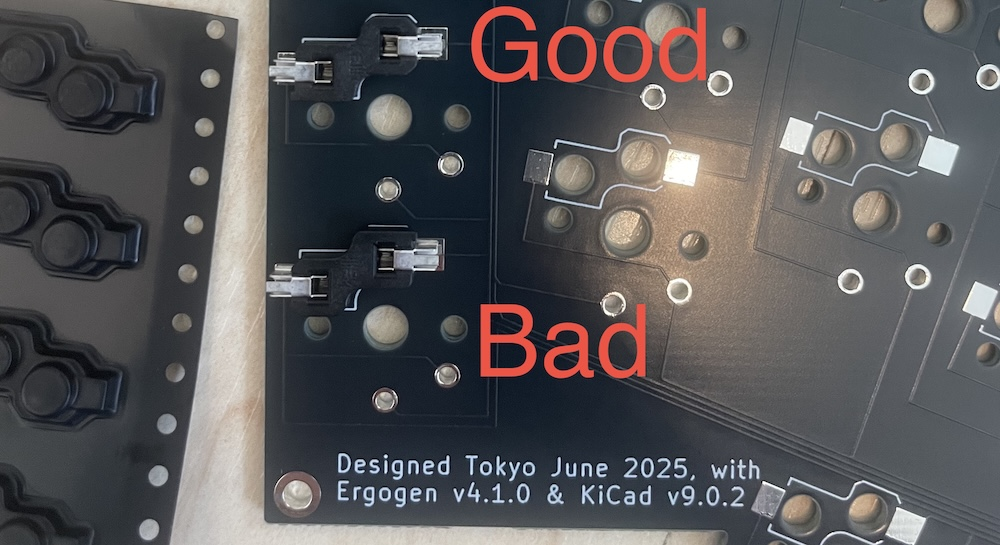
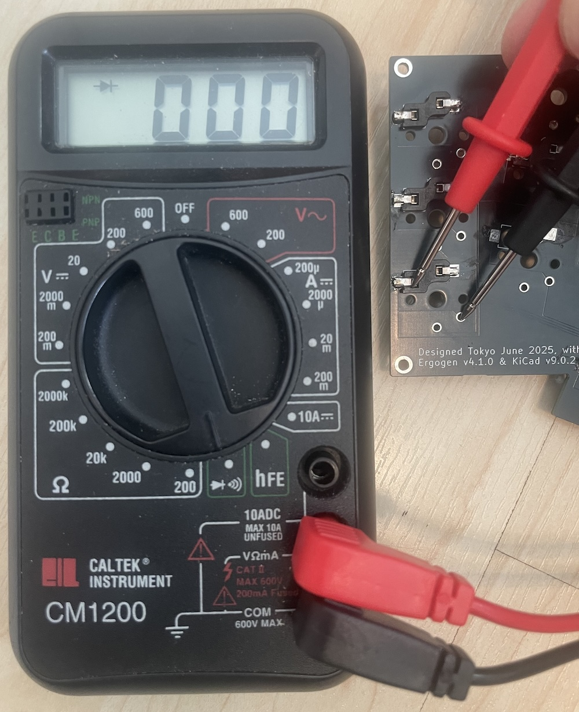
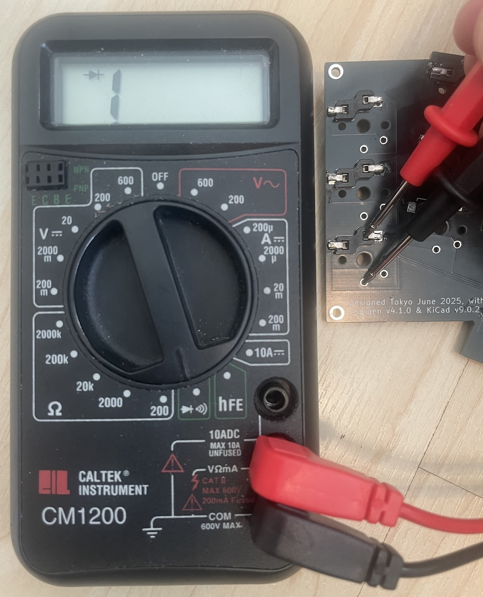
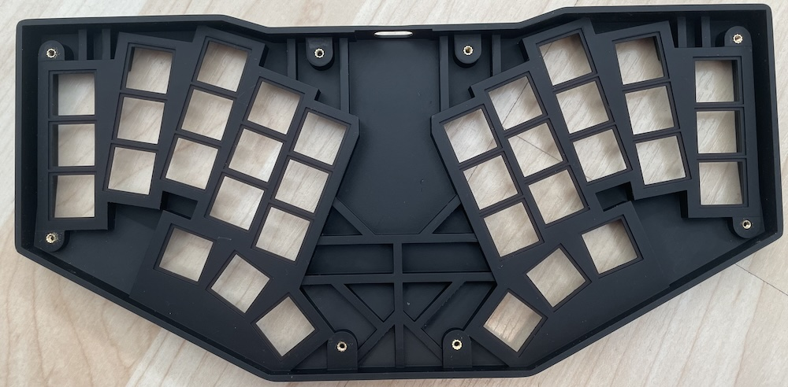

# TC36k Build guide

[Looking for the original's build guide?](../original/BUILD_GUIDE.md)

# Parts List
| Part | Quantity | Details | Source |
|------------------|----------|-----------------|--------|
| M2x2x3 Insert nut | 4 | M2 thread, 2mm length, 3.0mm outer diameter | |
| M2x6x3 Insert nut | 4 | M2 thread, 6mm length, 3.0mm outer diameter | |
| M2x6 Countersunk screw | 4 | 6mm length | |
| M2x8 Countersunk screw | 4 | 8mm length (or 6mm × 8) | |
| Feet bumpons | 6 | 8mm diameter, any height. | |
| Kailh Choc PG1350 HotSwap Sockets | 36 | 💡 |
| Kailh Choc v1 switches | 36 | PG1350 | 💡 |
| Keycap | 36 | MBK, CFX, ... | |
| Gamma Omega Hesse PCB | 1 | 1.6mm thickness | JLCPCB |
| Hesse Top case | 1 | SLA Resin | JLC3DP |
| Hesse Bottom case | 1 | SLA Resin | JLC3DP |
| 90 degree reset switch | 1 | Like [Tyco Electronics (TE) 1825027-8](https://www.te.com/en/product-1825027-8.html), a sideways 6x6mm base. Exact button stem height to be confirmed | |
| JST connector | 1 | JST PH 2.0mm | |
| 3.7V LiPo battery | 1 | eg 300mAh LP602030 with JST connector | 💡 |
| Nice!Nano v2 or clone | 1 | The [SuperMini NRF52840](https://kriscables.com/supermini-nrf52840/) aka [ProMicro NRF52840](https://www.nologo.tech/product/otherboard/NRF52840.html) is tested. | [Offical](https://nicekeyboards.com/nice-nano#find-a-store), [Aliexpress](https://www.aliexpress.com/item/1005006035267231.html) |
| Pin headers/diode legs | 35+ | Use the headers included with the controller |  |

> [!NOTE]
> The PCB is design to mount the controller face up directly on the PCB, faux-castellated style.
> The mounting holes for the extra middle trio of pins are different between the Nice!Nano v2 and clones.

> [!NOTE]
> No-stabilizer Choc v2 switches should work too, the central hole is large enough.
> However, since the key spacing is 18x17mm, there are not many compatible keycaps.

> [!TIP]
> This PCB allows directly soldering the choc switches (rotated 180 degrees) without using hot-swap sockets.
> However, that will not work with the suggested case bottom (which has hot-swap cut-outs).

> [!TIP]
> The battery compartment will take a 300mAh LP602030 battery fine, but a little larger could work too.
> For example, the longer ~480mAh LP602035 ought to fit (untested), and *perhaps* even
> a little thicker (but you do not want to squeeze the battery)?

## Tools

- Soldering tools.
- Safety gears.
- Wire cutters (to trim controller header pins).
- Circuit tester.
- USB cable and computer (for flashing the controller).
- epoxy adhesive (or cyanoacrylate adhesive) for fixing insert nuts.

> [!WARNING]
> For your safety: Wear protective eyewear, be cautious of hot components, and ensure proper ventilation to avoid inhaling toxic fumes.

## Firmware Flashing

1. Download the `hesse-nice_nano_v2-zmk.uf2` firmware.
2. Connect the controller, the clones are pre-loaded with a blink program.
  * Check the left LED flashes once a second
  * Check the right LED turns on or off every second
  * With a multimeter check all 21 GPIO pins cycle from 0 to 3.3V once a second. 
3. Short the reset pin (RST) to any of the ground pins (GND) twice in a second (just tap a few times).
4. USB Mass Storage device named "NICENANO" appears.
5. Copy the `hesse-nice_nano_v2-zmk.uf2`` firmware file to this storage device.
  * On macOS you may get a error code -36 about failing to complete. This seems to be harmless here.
6. The storage will disconnect automatically.
  * On macOS you well get a notification recomending unmounting before disconecting
7. The device should now function as a keyboard when the firmware is successfully installed.
  * The battery charging LED will continue to flash with no battery connected.
  * You can try shorting pins like `D1/P0.06` and `D0/P0.08` top left which should type Qwerty `E`.
7. Disconnect the USB cable to the controller.

> [!TIP]
> It is a little fiddly without a reset button, but flashing *before* soldering to
> the PCB should catch a bad controller early on.

## Hotswap Socket Installation

1. Install hotswap sockets according to the PCB markings.
2. Ensure correct orientation of the sockets; while they can physically fit in either direction, the bottom case cutouts are designed for the correct orientation only.
3. Test the soldered connection of each hotswap pad with a circuit tester using the 180-degree rotated direct solder holes. That's 72 tests, but very easy!

## Nice!Nano v2 or Clone Installation

1. Install the controller on the UP side of the PCB (opposite from where hotswap sockets were installed).
2. Position the controller flat directly on the PCB with its components facing up and the USB port facing outward.
3. Use pins of the headers provided (without the insulators) to solder the controller onto the PCB.
  * Start with the four corners.
  * Then finish all 16 pins of each side.
  * Finally, the three extra pins in the middle.
    These will be much the same for the offical Nice!Nano v2, but the clones positioned them about
    2mm down and right which needs a longer briging wire - ideally pre-bent like a staple.
4. After soldering, carefully trim all protruding pins with a nipper.

*Your PCB should look like this when completed (hopefully with neater soldering):*

TODO

> [!CAUTION]
> For your safety, please wear safety glasses — trimmed pins can be sharp and may fly off during cutting.

## Initial Testing
Connect the USB-C port on the assembled PCB, and it should still register as a keyboard.
The power LED be flashing (since there is no battery yet).

As in the firmware notes above, press Caps Lock on your main keyboard and confirm the
blue LED lights up (again, somewhat hidden).

Use your favorite keystroke tester with a conductive tweezer to verify that all keys are working properly.

## Reset Switch

## Battery Connection

## Battery Testing

1. With the controller NOT connected by USB, connect the battery using the JST socket.
  * The keyboard should be available on USB and advertise on Bluetooth.
  * The battery will usually be empty on shipping, so we don't expect anything to happen when connecting it.
2. The battery should start charging - note the change in the LED.
3. Wait a few minutes, monitor the battery for signs of overheating.
4. Disconnect the USB
  * The LEDs should show it is still on
  * Check "Hesse" is still advertised on Bluetooth.
5. Optionally disconnect the battery.

## Case Assembly

1. Install 6mm threaded inserts with epoxy adhesive on the top case (upper side, near the USB port hole).
2. Install 2mm threaded inserts with epoxy adhesive on the top case (lower side, opposite the USB port hole).

> [!TIP]
> You may not need the glue, mine seems fine with friction alone.

3. Connect the battery, keep it on the hotswap side with the wire though the battery cutout.
4. Place the PCB into the top case, taking care to align the reset button and USB port (battery free on top).
5. Place battery into the compartment.
6. Install switches into the top case while holding the PCB (hotswap sockets) in place.
7. Adjust battery wire to fit inside.
5. Place the bottom case onto the top case assembly.
6. Secure with screws (8mm or 6mm for upper side, 6mm for lower side).

> [!TIP]
> Do not over-tighten: the screws should only need to support the bottom case's weight.

> [!CAUTION]
> If the top case has warped ever so slightly, then the switches and outer screws should bend it straight.

## DONE!

TODO. Describe initial Bluetooth connection etc.

### Everything is done.

How does it feel? Comfortable? Any issues? Does it work as you expected?

Whatever the result, we’d really appreciate it if you shared your experience with the community.

Thank you for building it!
