# TC36k Build guide

[looking for the original's build guide?](../original/BUILD_GUIDE.md)

> [!WARNING]
> Work in progress

# Parts List
| Part | Quantity | Details | Source |
|------------------|----------|-----------------|--------|
| M2x2x3 Insert nut | 4 | M2 thread, 2mm length, 3.0mm outer diameter | |
| M2x6x3 Insert nut | 4 | M2 thread, 6mm length, 3.0mm outer diameter | |
| M2x6 Countersunk screw | 4 | 6mm length | |
| M2x8 Countersunk screw | 4 | 8mm length (or 6mm × 8) | |
| Feet bumpons | 6 | 8mm diameter, any height. | |
| Kailh Choc PG1350 HotSwap Sockets | 36 | 💡 |
| Kailh Choc v1 switches | 36 | PG1350 | ⚠️ |
| Keycap | 36 | MBK, CFX, ... | |
| Gamma Omega TC36K PCB | 1 | 1.6mm thickness | JLCPCB |
| Top case | 1 | SLA Resin | JLC3DP |
| Bottom case | 1 | SLA Resin | JLC3DP |
| Pi Pico USB-C RP2040 | 1 | YD-RP2040 Variants are tested. [Info](https://circuitpython.org/board/vcc_gnd_yd_rp2040/) | [Aliexpress](https://a.aliexpress.com/_opuRQZl) ⚠️ |
| 20-pin headers |  2 | Included with RP2040, ~2.5mm insulation height |  |

> [!NOTE]
> The bottom case and PCB has a hole allowing access to the boot button on the RP2040 controller, which is mounted facing down once fully assembled.
> The placement of any boot/reset/user buttons varies between boards, even if they are pin-compatible.
> The expected placement (looking at the controller chips upward with the USB and pin 1 at the top) is on the left near pins 7, 8 & 9 (GP5, GND & GP6).
> This is the "black" controller at the Ali Express link:
> 
>
> This Pi Pico variant has 28 GPIOs available (GP29 and GP23 on pins 35 and 37),
> required in the original Gamma Omega dual PCB design, but which are unused in the TC36K PCB.
> As long as you don't care about the boot button, standard 26 GPIO Pi Pico designs *should* be fine (untested).

> [!NOTE]
> With a minor change to the central hole for each switch (using `choc_v2_support: true` in Ergogen),
> the PCB could be made compatible with choc v1 and v2.
> However, since the key spacing is 18x17mm, there are not many compatible keycaps.

> [!TIP]
> This PCB allows directly soldering the choc switches (rotated 180 degress) without using hot-swap sockets.
> However, that will not work with the suggested case bottom (which has hot-swap cut-outs).

## Tools

- Soldering tools.
- Safety gears.
- Wire cutters (to trim controller header pins).
- Circuit tester.
- USB cable and computer (for flashing the controller).
- epoxy adhesive (or cyanoacrylate adhesive) for fixing insert nuts.

> [!WARNING]
> For your safety: Wear protective eyewear, be cautious of hot components, and ensure proper ventilation to avoid inhaling toxic fumes.

## Firmware Flashing
1. Download the [tutte_coxeter_36k_vial.uf2](https://github.com/peterjc/qmk_userspace/releases/download/latest/tutte_coxeter_36k_vial.uf2) firmware.
2. Press and hold the `BOOT` button while connecting the controller to your computer by USB.
3. Release the `BOOT` button when a Mass Storage device named "RPI-RP2" appears.
4. Copy the `tutte_coxeter_36k_vial.uf2` firmware file to this storage device.
5. The storage will disconnect automatically, and the device will function as a keyboard when the firmware is successfully installed.
6. Try toggling CAPS LOCK on your main keyboard, the blue LED on the controller by the USB socket (opposite the red power LED) should come on.
7. Disconnect the USB cable to the controller.

> [!TIP]
> Flashing *before* soldering in the PCB should catch a bad controller early on.

## Hotswap Socket Installation
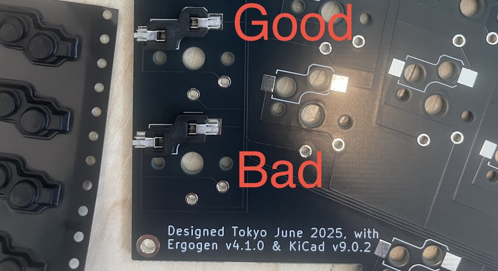

1. Install hotswap sockets according to the PCB markings.
2. Ensure correct orientation of the sockets; while they can physically fit in either direction, the bottom case cutouts are designed for the correct orientation only.
3. Test the soldered connection of each hotswap pad with a circuit tester using the 180-degree rotated direct solder holes. That's 72 tests, but very easy!

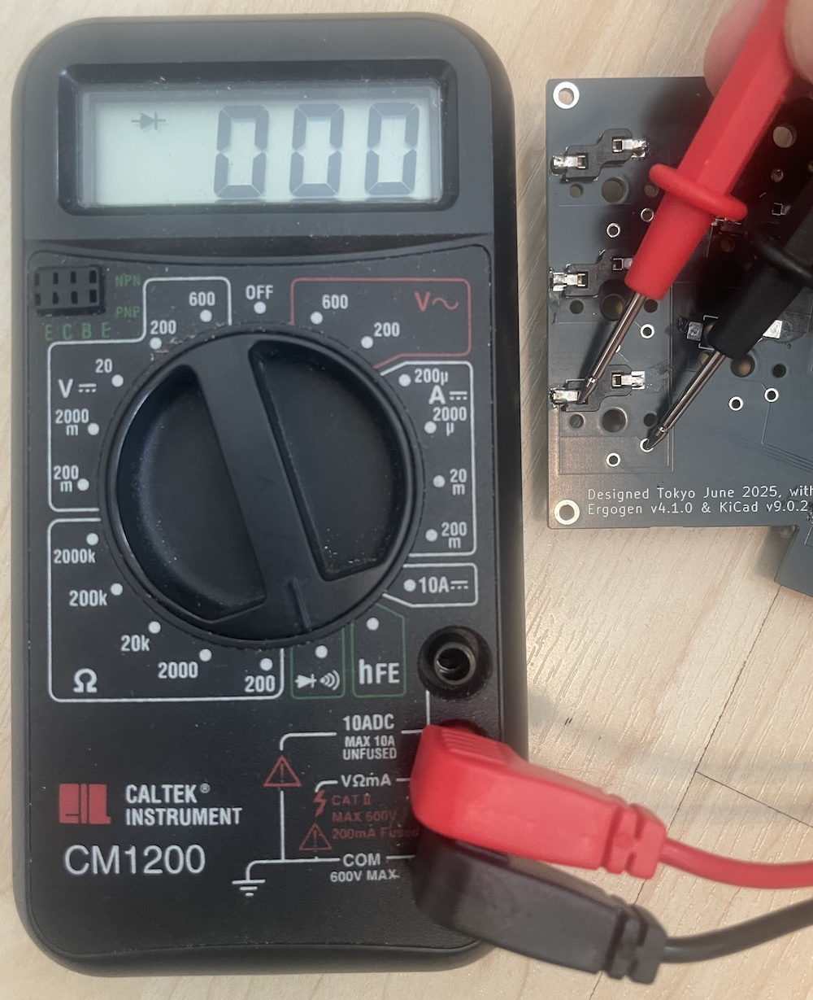
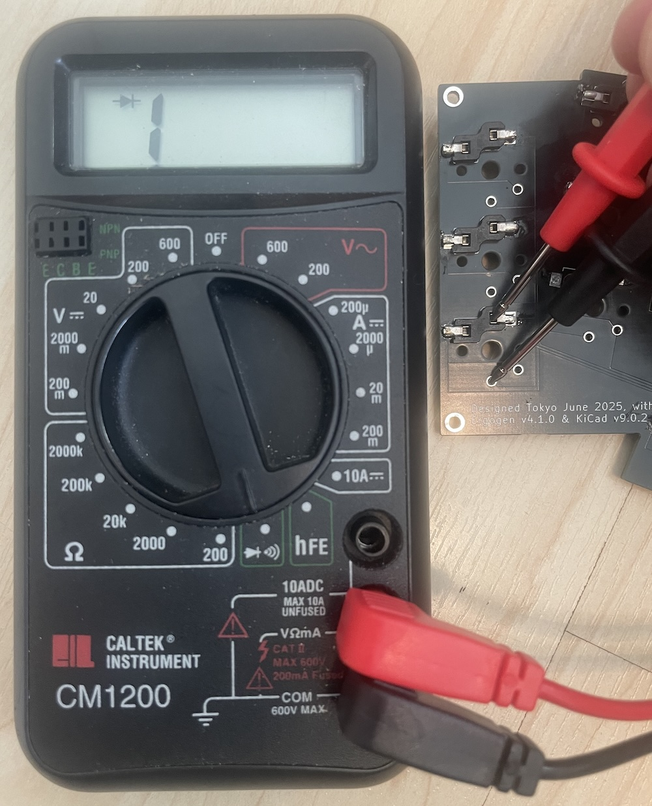

## Pi Pico Installation

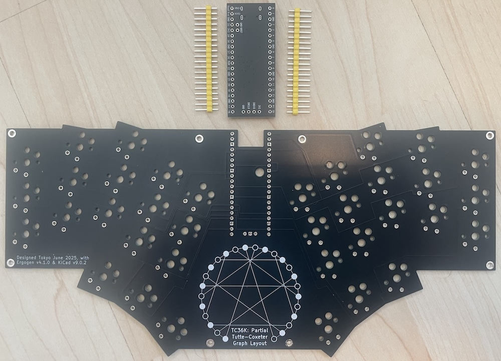
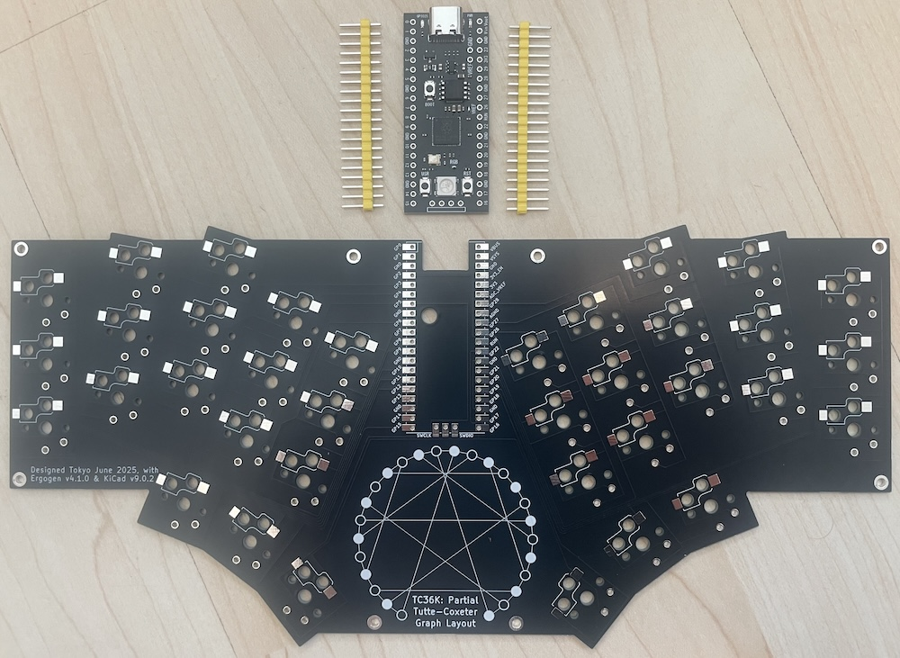

1. Install the Pi Pico on the UP side of the PCB (opposite from where hotswap sockets were installed).
2. Position the Pi Pico with its components facing down toward the PCB and the USB port facing outward.

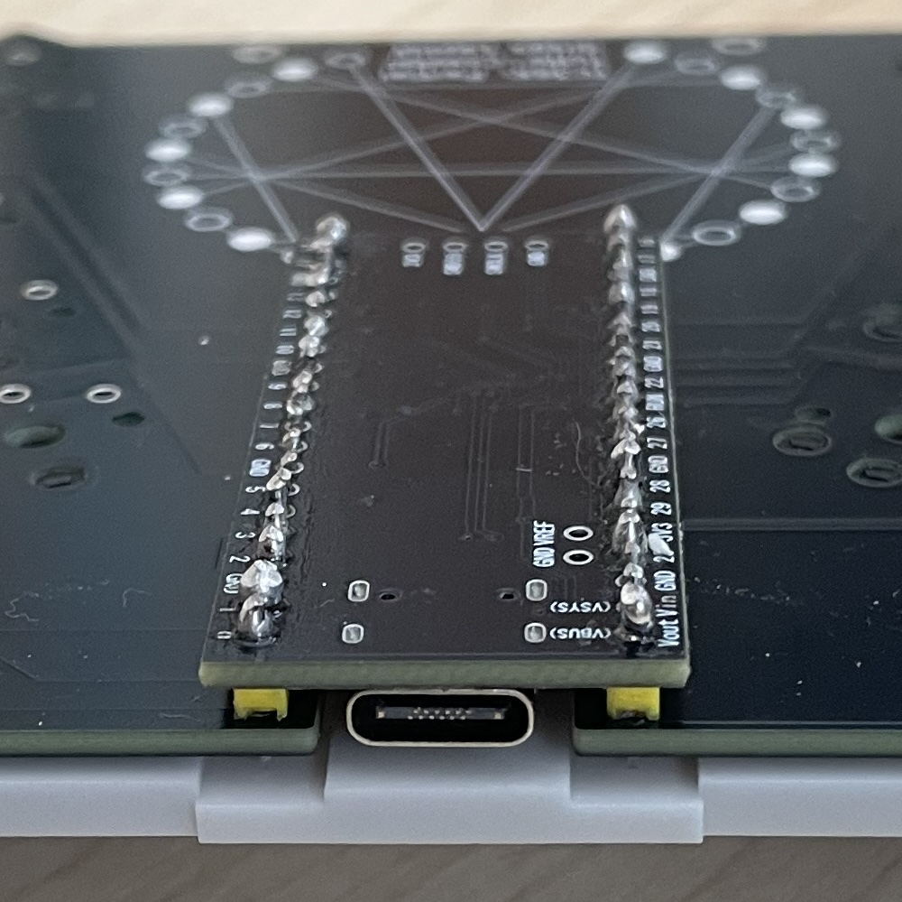

3. Use the two 2.54mm × 20-pin headers provided (with 2~2.5mm height insulators) to solder the Pi Pico onto the PCB. I had the short legs on the hotswap side as clearance is tightest with the bottom case.We do not use the three pins opposite the USB port.
4. After soldering, carefully trim all protruding pins with a nipper.

*Your PCB should look like this when completed (hopefully with neater soldering):*

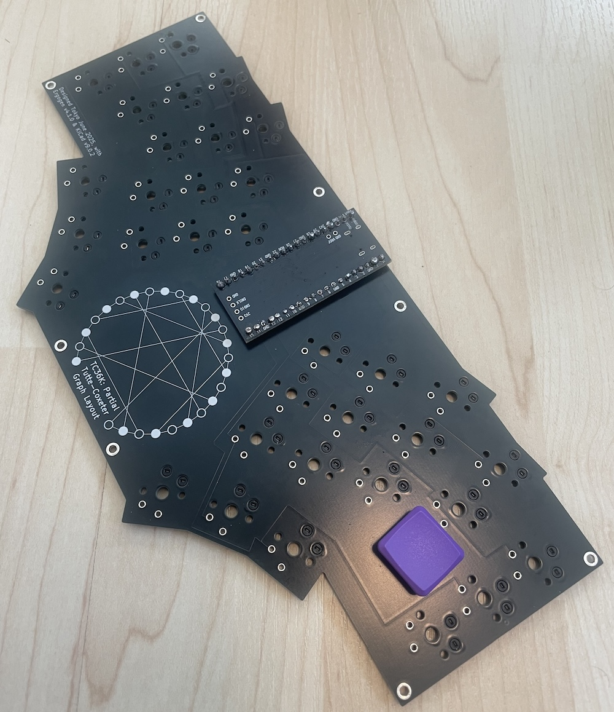
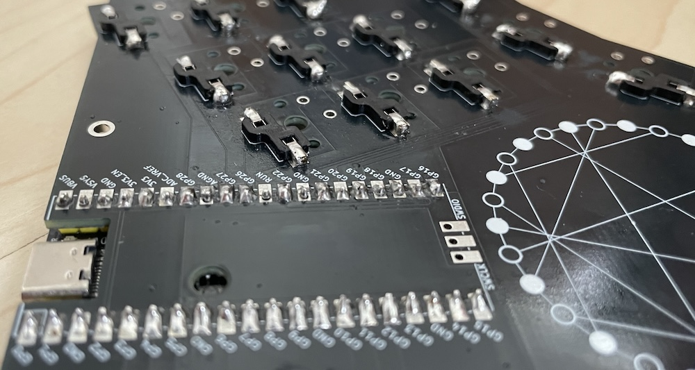
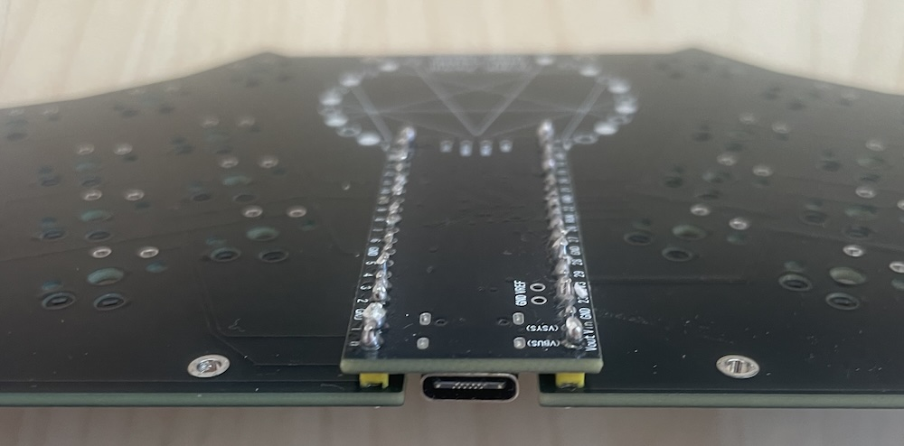

> [!CAUTION]
> For your safety, please wear safety glasses — trimmed pins can be sharp and may fly off during cutting.

## Testing
Connect the USB-C port on the assembled PCB, and it should still register as a keyboard.
The red power LED should light up (somewhat hidden).

As in the firmware notes above, press Caps Lock on your main keyboard and confirm the
blue LED lights up (again, somewhat hidden).

Use your favorite keystroke tester (or Vial's Key matrix tester) with a conductive tweezer
(or a switch as in one of the photos) to verify that all keys are working properly.

## Case Assembly
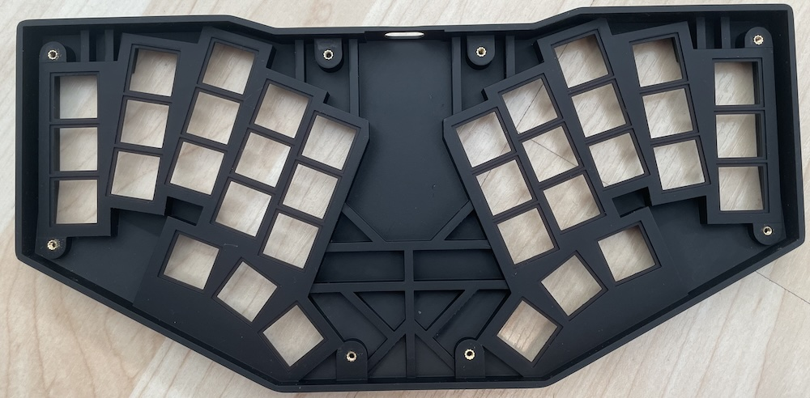

1. Install 6mm threaded inserts with epoxy adhesive on the top case (upper side, near the USB port hole).
2. Install 2mm threaded inserts with epoxy adhesive on the top case (lower side, opposite the USB port hole).

> [!TIP]
> You may not need the glue, mine seems fine with friction alone.

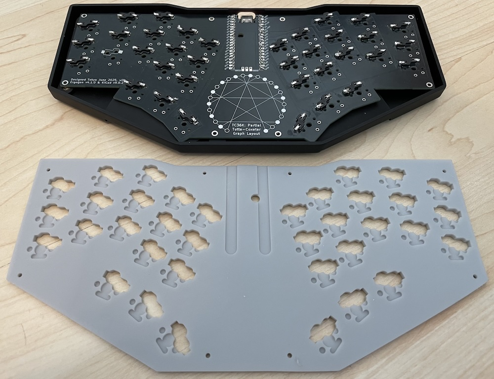

3. Place the PCB onto the top case.
4. Install switches into the top case while holding the PCB (hotswap sockets) in place.
5. Place the bottom case onto the top case assembly.
6. Secure with screws (8mm or 6mm for upper side, 6mm for lower side).

> [!TIP]
> Do not over-tighten: the screws should only need to support the bottom case's weight.

> [!CAUTION]
> My top case had warped ever so slightly, meaning the outer screws etc are also bending it straight.

## DONE!

Photos to follow.

### Everything is done.

how does it feel? Comfortable? Any issues? Does it work as you expected?

Whatever the result, I’d really appreciate it if you shared your experience with the community.

Thank you for building it!
