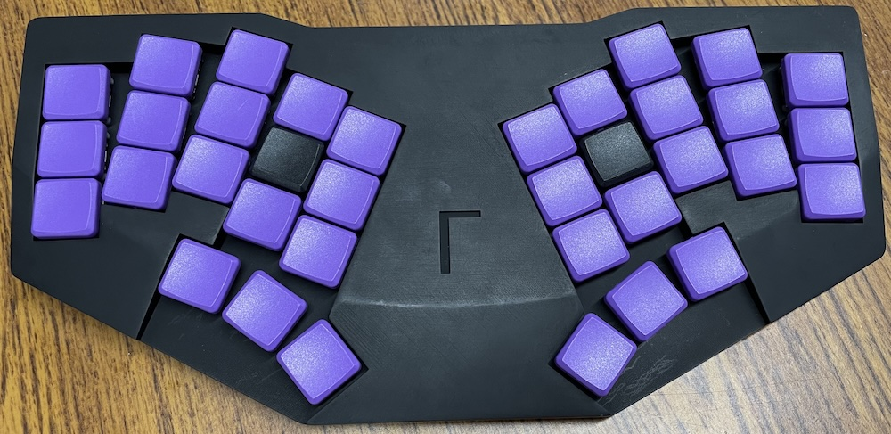
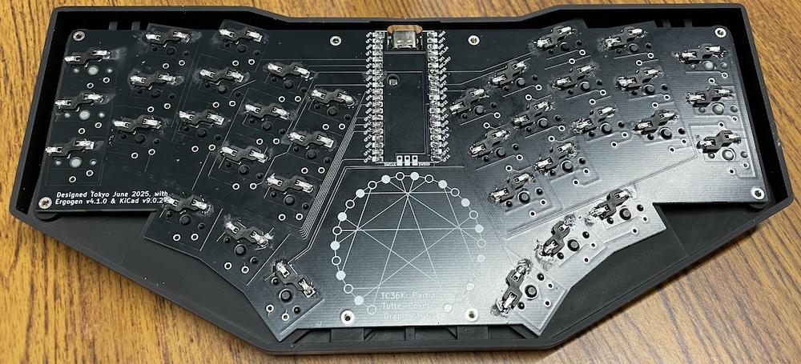

# Gamma-Omega TC36K - mono PCB without diodes

The [original Gamma-Omega](../original/) has a left & right PCB (with the same reversible design),
joined at the middle with the controller daughter board itself.

This folder contains an alternative larger single PCB design, intended to fit the same case.
Larger PCBs are more expensive, doubly so with the typical minimum order of five - so why do this?
This is a [no-diode design using graph theory to have a 36 key keyboard using only 26 GPIO
pins](https://astrobeano.blogspot.com/2025/05/ergo-mech-keyboard-wiring-using-tutte-coxeter-graph.html).
The cost saving for no diodes is minimal, but with far less parts and soldering,
this design should be quicker and easier to assemble.

Specfically, it uses a partial *Tutte Coxeter graph*, with only 26/30 nodes/vertices/pins,
and 36/45 edges/switches/keys (thus "TC36K"), but still girth 8 for 6-key rollover. 

The sub-folder structure is as follows:

* `ergogen/` contains the Erogen configuration defining the key-placement and wiring net.
  That generates a blank PCB design without traces.
* `pcb/` contains the Erogen PCB edited to add the traces and silkscreen art.
* `pcb/production/pcb/` contains the Gerbers file `gamma-omega-tc36k_v1.0.0.zip` for getting
  the PCB fabricated at JLCPLC or similar, and BOM & position files which might work for
  assembly with the hot-swap sockets (untested as not currently available).

This needs different firmware to the original Gamma Omega design, see
[Tutte Coxeter 36K firmware](https://github.com/peterjc/qmk_userspace/tree/main/keyboards/tutte_coxeter_36k).

## Photos

 

## Credits

[triliu/Heawood42](https://github.com/triliu/Heawood42) - the first no-diode keyboard using graph theory (42 key split)

[triliu/JESK56](https://github.com/triliu/JESK56) - later no-diode 56 key monoblock keyboard using graph theory

