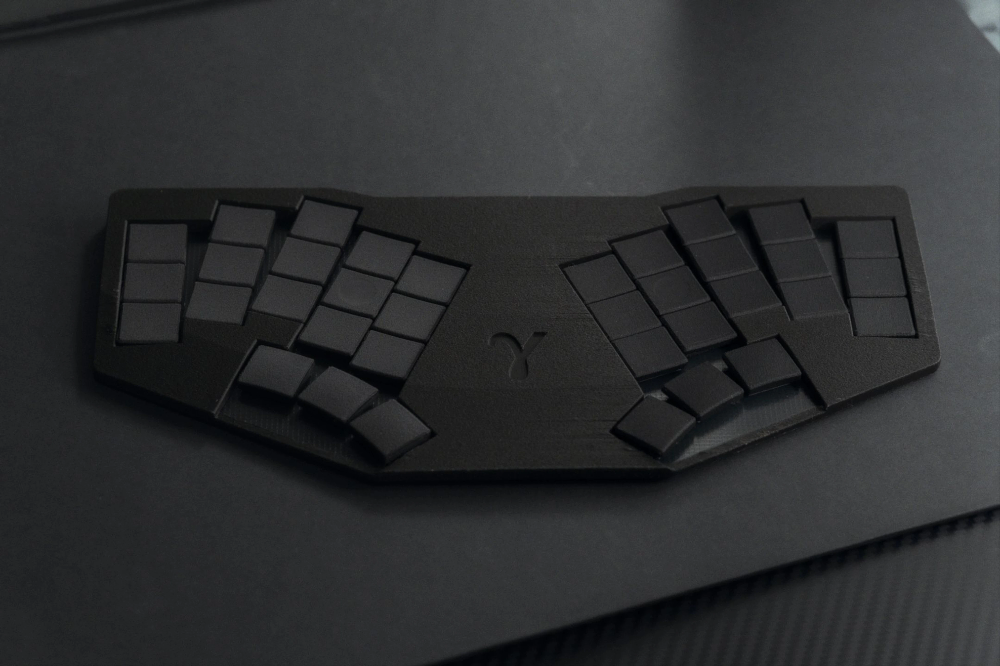
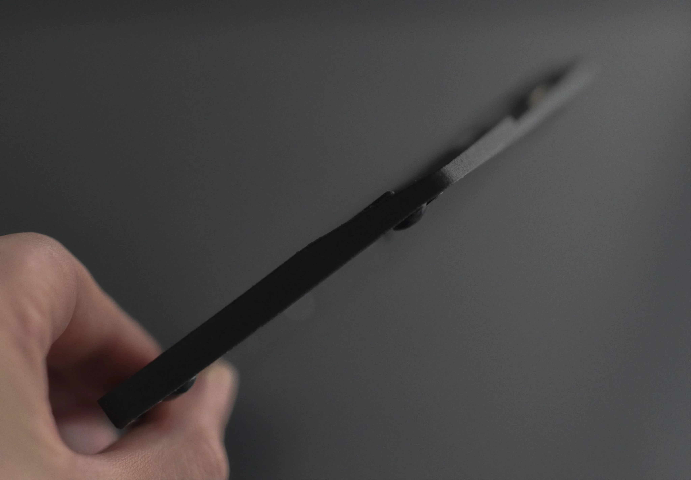
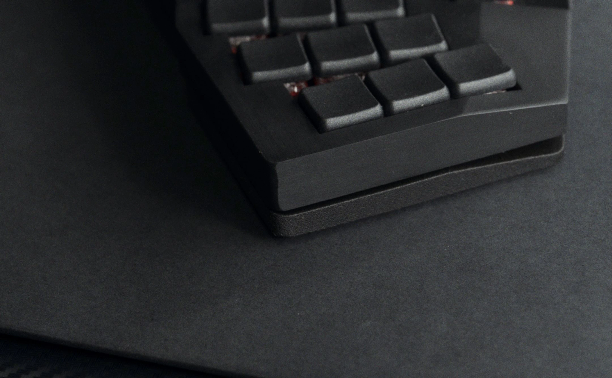
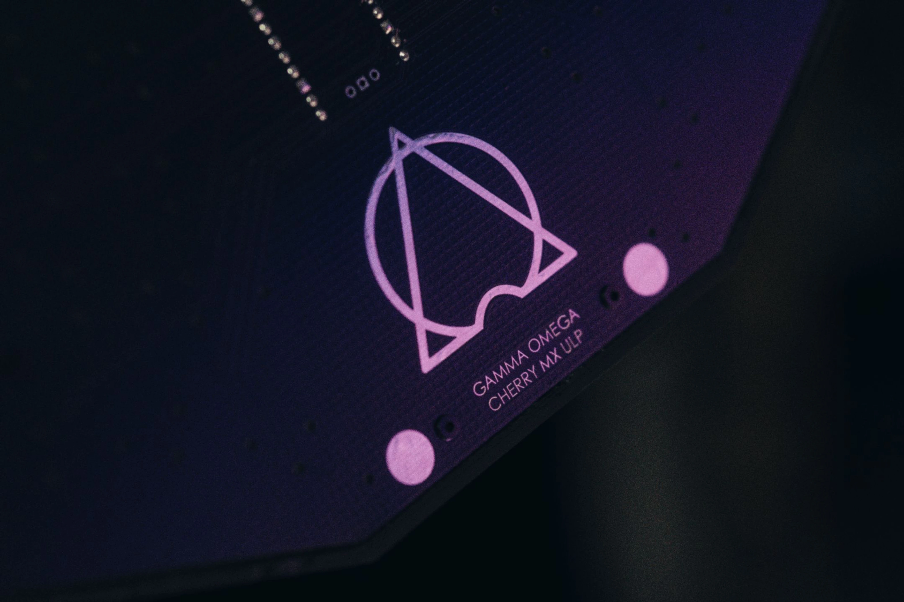

# Gamma-Omega ULP - Cherry MX Ultra Low Profile Switch variants

> [!WARNING]
> Work in progress.

*top origianl, bottom ulp*

## Quick Links
- [3D Printable Case](../cases/)
- [PCB](pcb/) 
- [Ergogen Configuration](ergogen/README.md) 
- Firmwares
    - [QMK/VIAL Implementation](firmwares/QMK/gamma_omega/)
    - [ZMK Firmware](https://github.com/unspecworks/zmk-config-gamma-omega)
- [Build Guide](BUILD_GUIDE.md)

## Case

Although this variant shares the same layout as the original and TC36k, it has its own dedicated case to fully leverage the advantages of ULP.
Despite the same layout, a different case and PCB are required.

And unlike the original version, it will be designed to be FDM printable.

## PCB Design

This variant is based on the Tutte-Coxeter graph routing of the TC36k and also uses a single mono PCB.
For more details, please refer to the [TC36k PCB](../tc36k/README.md) documentation.

## Prototype logs
### v0.0.1 
- The first prototype had an overall height of just 5mm.
- The 0.8mm PCB turned out to be unsuitable for heavy use due to its lack of rigidity.
- The PLA FDM case was too flexible and prone to bending, leading to typing issues in various scenarios.
- The wall near the MCU soldering area was likely too thin, and there wasn't enough space for the controller.
- To improve print quality, I tried printing the case at a 45-degree angle, but the thin structure and numerous overhangs resulted in poor-quality prints.
I plan to iterate on this design to find better printing strategies and structural improvements. 